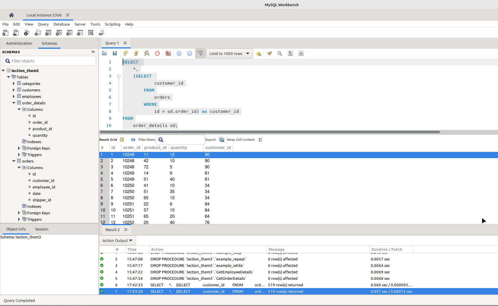
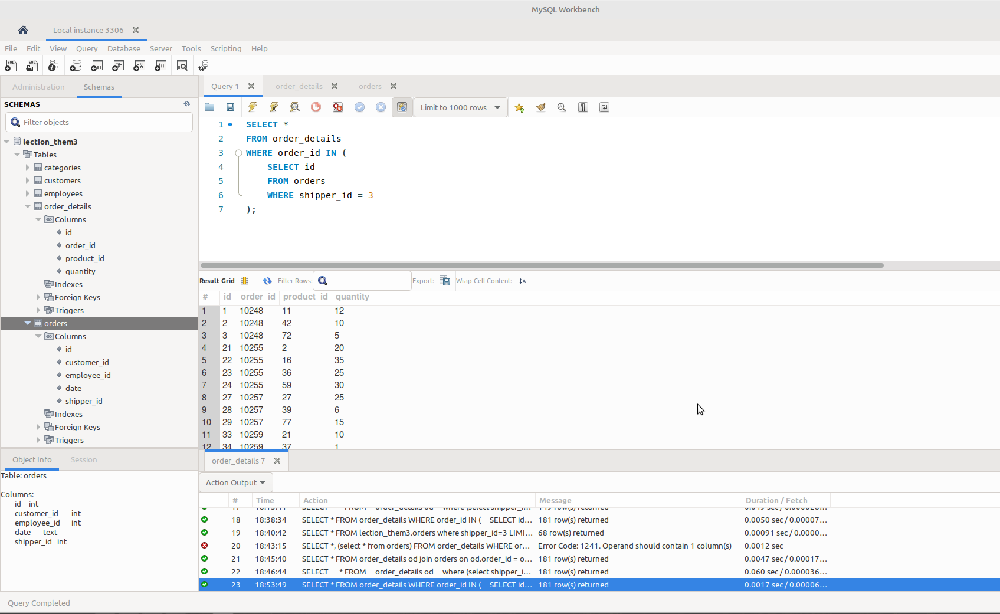
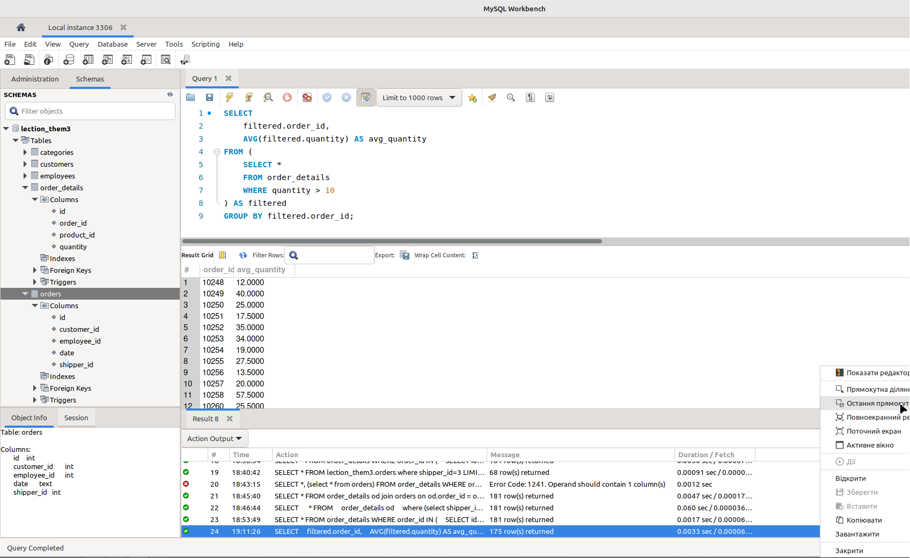
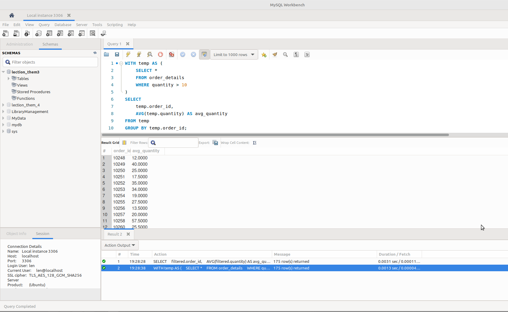
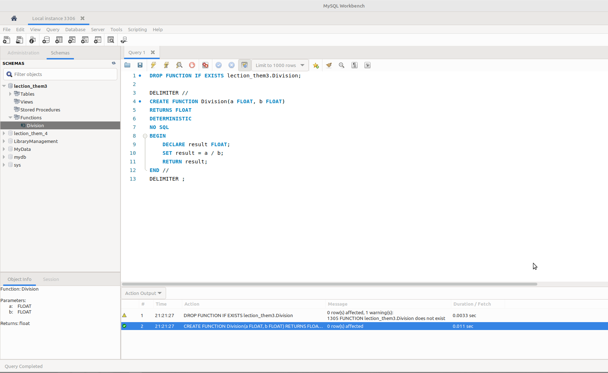
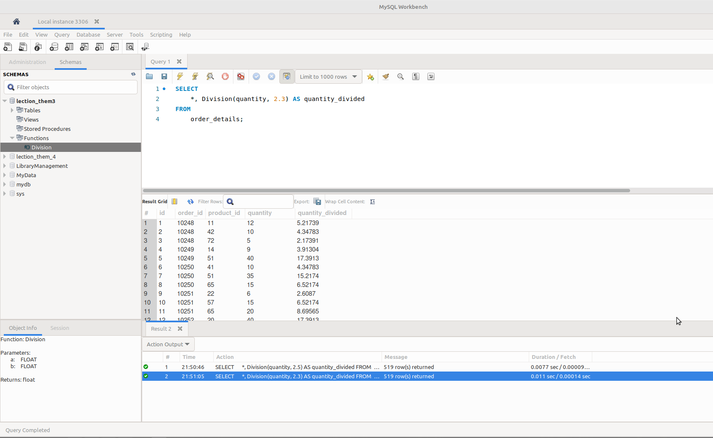

# goit-rdb-hw-05

Домашнє завдання до Теми 5. Вкладені запити. Повторне використання коду

### Завдання 1:

> Напишіть SQL запит, який буде відображати таблицю order_details та поле customer_id з таблиці orders відповідно для кожного поля запису з таблиці order_details. Це має бути зроблено за допомогою вкладеного запиту в операторі SELECT.

---

```sql
SELECT
    *,
    (SELECT
            customer_id
        FROM
            orders
        WHERE
            id = od.order_id) as customer_id
FROM
    order_details od;
```

_p1_nested_select.png_


---

### Завдання 2:

> Напишіть SQL запит, який буде відображати таблицю order_details. Відфільтруйте результати так, щоб відповідний запис із таблиці orders виконував умову shipper_id=3. Це має бути зроблено за допомогою вкладеного запиту в операторі WHERE.

---

```sql
SELECT *
FROM order_details
WHERE order_id IN (
    SELECT id
    FROM orders
    WHERE shipper_id = 3
);
```

_p2_nested_where.png_


---

### Завдання 3:

> Напишіть SQL запит, вкладений в операторі FROM, який буде обирати рядки з умовою quantity>10 з таблиці order_details. Для отриманих даних знайдіть середнє значення поля quantity — групувати слід за order_id.

---

```sql
SELECT
    filtered.order_id,
    AVG(filtered.quantity) AS avg_quantity
FROM (
    SELECT *
    FROM order_details
    WHERE quantity > 10
) AS filtered
GROUP BY filtered.order_id;
```

_p3_nested_from.png_


---

### Завдання 4:

> Розв'яжіть завдання 3, використовуючи оператор WITH для створення тимчасової таблиці temp. Якщо ваша версія MySQL більш рання, ніж 8.0, створіть цей запит за аналогією до того, як це зроблено в конспекті.

---

```sql
WITH temp AS (
    SELECT *
    FROM order_details
    WHERE quantity > 10
)
SELECT
    temp.order_id,
    AVG(temp.quantity) AS avg_quantity
FROM temp
GROUP BY temp.order_id;
```

_p4_with.png_


---

### Завдання 5:

> Створіть функцію з двома параметрами, яка буде ділити перший параметр на другий. Обидва параметри та значення, що повертається, повинні мати тип FLOAT.\
> Використайте конструкцію DROP FUNCTION IF EXISTS. Застосуйте функцію до атрибута quantity таблиці order_details . Другим параметром може бути довільне число на ваш розсуд.

---

##### Створення функції:

```sql
DROP FUNCTION IF EXISTS lection_them3.Division;

DELIMITER //
CREATE FUNCTION Division(a FLOAT, b FLOAT)
RETURNS FLOAT
DETERMINISTIC
NO SQL
BEGIN
	DECLARE result FLOAT;
    SET result = a / b;
    RETURN result;
END //
DELIMITER ;
```

_p5_create_function.png_


---

##### Використання функції:

```sql
SELECT
    *,
    Division(quantity, 2.3) AS quantity_divided
FROM
    order_details;
```

_p5_using_function.png_


---
